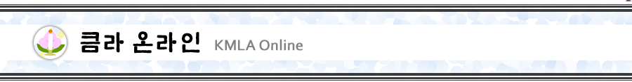
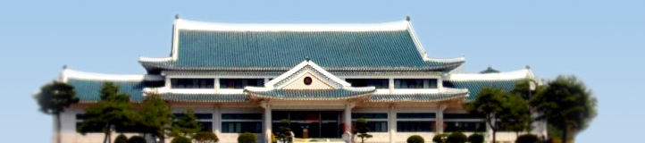
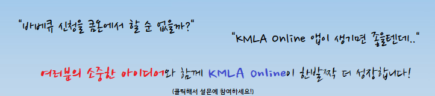
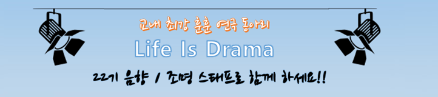
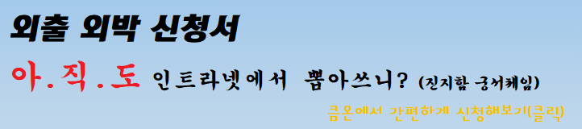

  

# KMLA Online 배너

## 2016년 이전

### Jan 26, 2016

## 2016년

### Feb 21, 2016

## 2017년

### Aug 28, 2017

### Sep 18, 2017

### Sep 28, 2017

### Oct 13, 2017

## 2018년

### Jan 28, 2018

## 2019년

### Aug 17, 2019

### Sep 17, 2019

### Sep 18, 2019

